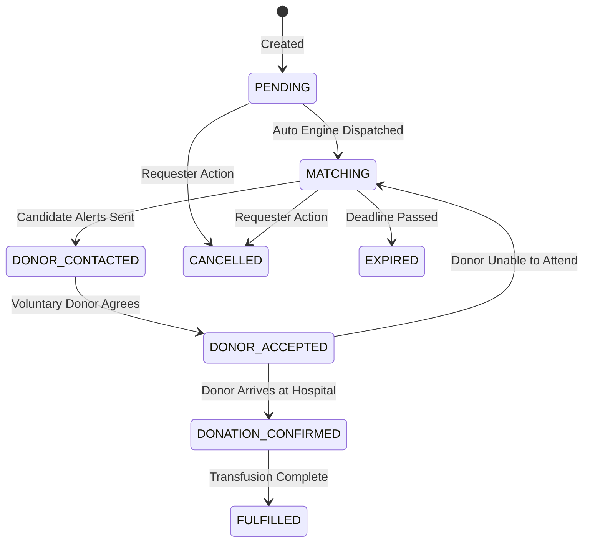

# RakthaSethu — Architectural Design Document

## 1. System Overview

**RakthaSethu** is a mission-critical, full-stack humanitarian emergency blood connection and donation platform. It operates as a high-reliability distributed system designed to minimize the critical minutes between a life-threatening blood requirement and voluntary donor arrival at a verified medical facility.

The architecture is divided into three primary layers:
1. **Interactive Client Application (Frontend)**: React, TypeScript, Vite, Tailwind CSS, TanStack Query, and Recharts.
2. **Core API & Business Logic Layer (Backend)**: Node.js, Express, TypeScript, Zod, JWT Security, and Modular AI service.
3. **Relational Data & ORM Layer (Database)**: PostgreSQL, Prisma ORM, strict constraints, foreign keys, and indexes.

---

## 2. High-Level Architecture Diagram

```
+-------------------------------------------------------------------------+
|                              CLIENT TIER                                |
|   (React 18 + TypeScript + Vite + Tailwind CSS + Lucide + Recharts)    |
|                                                                         |
|  [Public Site]     [Donor Hub]    [Patient Portal]   [Hospital & Bank]  |
|  - Landing Page    - Live Toggle  - Emergency Form   - Verification     |
|  - Finder & RBC    - Requests     - Match Tracker    - Inventory Cold-  |
|  - Campaigns       - Certificates - Direct Call      - Chain Audit      |
+-------------------------------------------------------------------------+
                                     │ HTTPS / REST (JSON)
                                     ▼
+-------------------------------------------------------------------------+
|                               API TIER                                  |
|   (Express.js + TypeScript + Helmet + CORS + Rate Limiter + Zod)        |
|                                                                         |
|   ┌─────────────────┬──────────────────┬─────────────────┬───────────┐  |
|   │ Auth & Tokens   │ Matching Engine  │ State Machine   │ AI Layer  │  |
|   │ (Argon2/bcrypt) │ (Haversine+RBC)  │ (Guarded FSM)   │ (Triage)  │  |
|   └─────────────────┴──────────────────┴─────────────────┴───────────┘  |
+-------------------------------------------------------------------------+
                                     │ Prisma ORM Client
                                     ▼
+-------------------------------------------------------------------------+
|                              DATA TIER                                  |
|                     (PostgreSQL 16 Relational DB)                       |
|                                                                         |
|   [Users]       [Profiles]      [BloodRequests]   [DonorMatches]        |
|   [Donations]   [BloodBanks]    [Inventories]     [AuditLogs]           |
+-------------------------------------------------------------------------+
```

---

## 3. Red Blood Cell (RBC) Compatibility Matrix

RakthaSethu strictly adheres to medical transfusion immunology rules:

| Recipient Blood Group | Compatible Donor Blood Groups (RBC) | Notes |
|---|---|---|
| **O-** | O- | Can only receive O- red cells |
| **O+** | O-, O+ | Can receive Rh+ or Rh- of group O |
| **A-** | O-, A- | Compatible with O- and A- |
| **A+** | O-, O+, A-, A+ | |
| **B-** | O-, B- | Compatible with O- and B- |
| **B+** | O-, O+, B-, B+ | |
| **AB-** | O-, A-, B-, AB- | All Rh- negative blood groups |
| **AB+** | **All 8 Groups** (O-, O+, A-, A+, B-, B+, AB-, AB+) | **Universal RBC Recipient** |

**Universal RBC Donor**: **O-Negative (O-)** has neither A nor B surface antigens and no Rh factor, allowing transfusion into any recipient in emergencies.

---

## 4. Multi-Factor Donor Matching Algorithm

The matching engine ranks donors based on five weighted dimensions:

$$\text{Total Score} = W_{\text{compat}} + W_{\text{exact}} + W_{\text{avail}} + W_{\text{urgency}} + W_{\text{dist}} + W_{\text{exp}}$$

1. **Blood Compatibility ($W_{\text{compat}} = 40$)**: Mandatory prerequisite. Donors who fail RBC compatibility are excluded immediately.
2. **Exact Blood Match ($W_{\text{exact}} = 10$)**: Donors whose blood group matches the recipient identically receive a precision bonus over universal donors.
3. **Availability Status ($W_{\text{avail}} = 20$)**: Donors currently marked active and available.
4. **Emergency Bonus ($W_{\text{urgency}} = 15$)**: For `CRITICAL` requests, donors with `emergencyAvailable = true` receive priority.
5. **Geographic Proximity ($W_{\text{dist}} = 0 \text{ to } 15$)**: Haversine distance formula:
   $$\text{Proximity Score} = \max\left(0, 15 \times \left(1 - \frac{\min(\text{distanceKm}, 100)}{100}\right)\right)$$
6. **Reliability & Experience ($W_{\text{exp}} = \min(5, \text{donations})$)**: Verified past donors receive priority.

---

## 5. Request Lifecycle Finite State Machine (FSM)

Blood requests strictly follow valid state transitions:



---

## 6. Privacy & Sensitive Data Minimization

- **Contact Masking**: Unaccepted donor candidates display masked numbers (e.g. `+91 98****3210`).
- **Address Privacy**: Exact street and house numbers are withheld until donor acceptance. Only approximate city and distance radius are exposed.
- **Audit Logs**: All state transitions, cancellations, and verification status changes are recorded in the `AuditLog` table.
